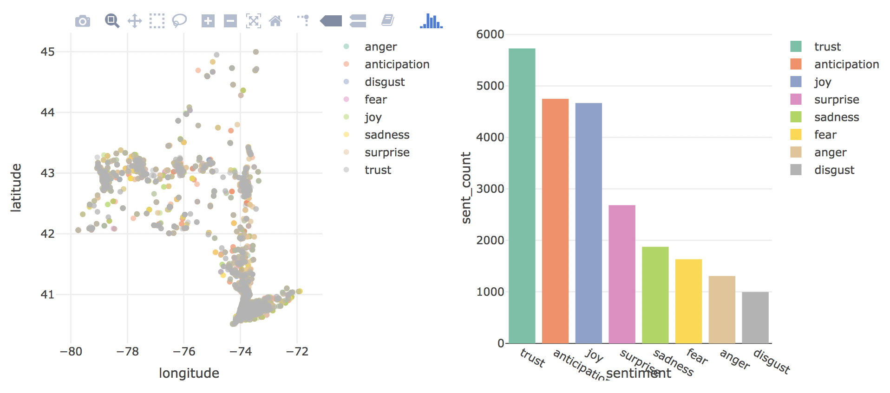

***

The map below shows the distribution of sentiments across the state of New York.  Alongside is a bar chart displaying the count of sentiment in the state.   
  

##Check it out!

 Click [here](https://np2547.shinyapps.io/states_shiny/) for the shiny app to explore! 

***

