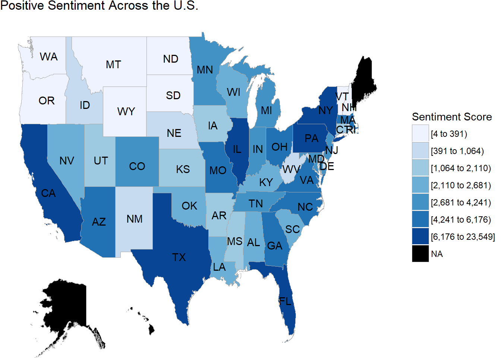
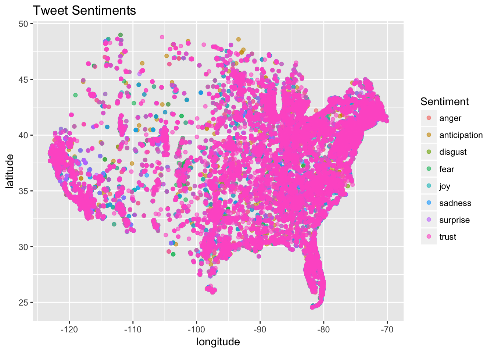
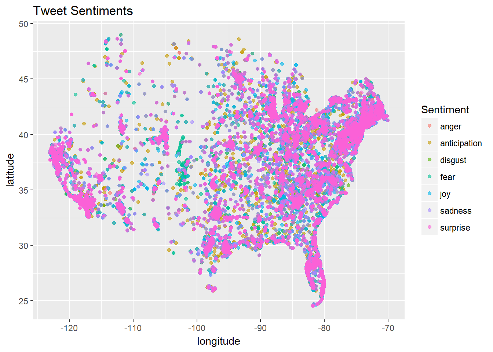

***

The maps below show the distribution of tweets with positive sentiment, and tweets of different emotions through the US. Since there was an overwhelming amount of "trust" emotion, an additional graph removes this emotion and shows distribution of other tweets. For the scores of the positive sentiment across the US plot, the measures are the sum of the Matthew Jocker's sentiment values for all tweets in each state. 

{ width=50% }{ width=50% }

{ width=50% }{ width=50% }

The shiny app below allows additional exploration, including the ability to view locations of different emotions, and emotions tweeted at different times.

 Click [here](https://kmaciejewski.shinyapps.io/p8105_final_shinyus/) for the shiny app to explore! 

***

